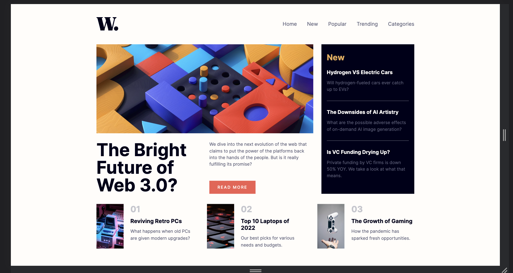
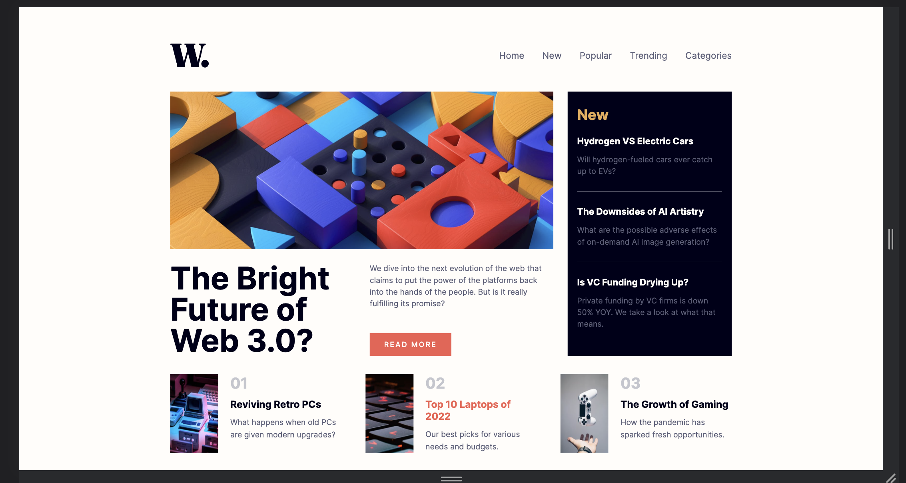
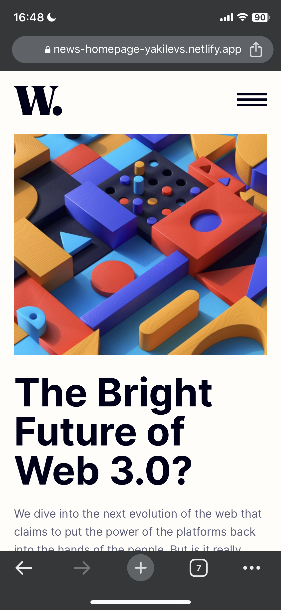
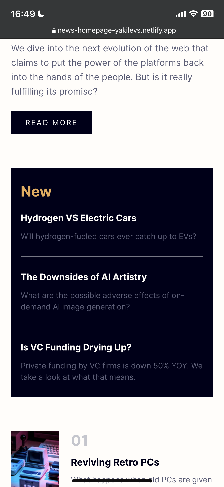
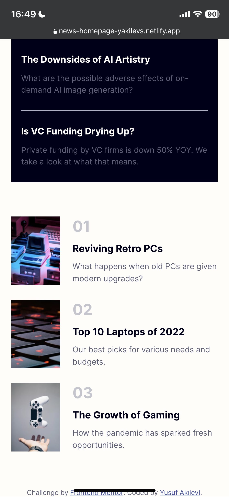
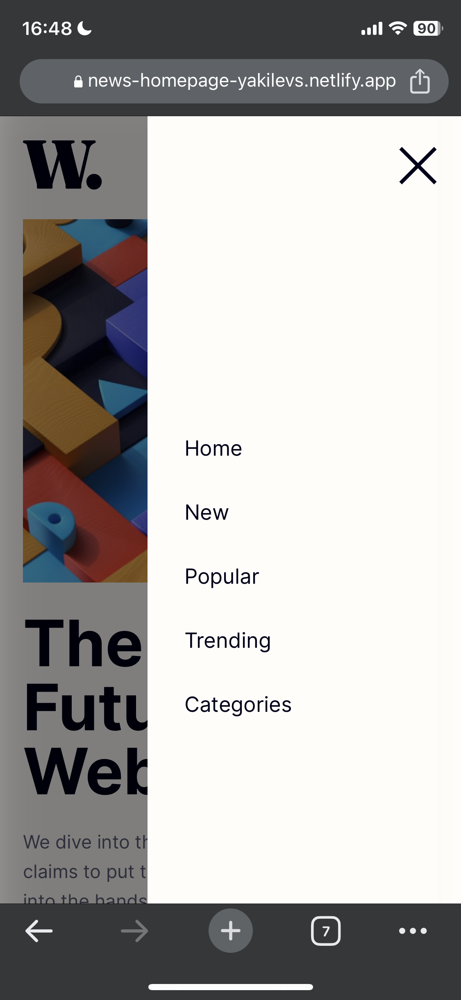

# Frontend Mentor - News homepage solution

This is a solution to the [News homepage challenge on Frontend Mentor](https://www.frontendmentor.io/challenges/news-homepage-H6SWTa1MFl). Frontend Mentor challenges help you improve your coding skills by building realistic projects.

## Table of contents

- [Overview](#overview)
  - [The challenge](#the-challenge)
  - [Screenshot](#screenshot)
  - [Links](#links)
- [My process](#my-process)
  - [Built with](#built-with)
  - [What I learned](#what-i-learned)
  - [Useful resources](#useful-resources)
- [Author](#author)
- [Acknowledgments](#acknowledgments)

## Overview

### The challenge

Users should be able to:

- View the optimal layout for the interface depending on their device's screen size
- See hover and focus states for all interactive elements on the page

### Screenshot

### Links

- Solution URL: [https://github.com/YusufAkilevi/News-Homepage-Frontend-Mentor](https://github.com/YusufAkilevi/News-Homepage-Frontend-Mentor)
- Live Site URL: [https://news-homepage-yakilevs.netlify.app/](https://news-homepage-yakilevs.netlify.app/)

## My process

### Built with

- Semantic HTML5 markup
- CSS custom properties
- Flexbox
- CSS Grid
- Desktop-first workflow
- JavaScript

### What I learned

I learned how to create mobile navigation by hiding main navigation bar and opening when mobile navigaiton button is clicked.

### Useful resources

- [MDN](https://developer.mozilla.org/en-US/) - This helped me to find anything related Javascript, CSS or HTMl.
- [CSS Tricks](https://css-tricks.com/) - This website explains css properties really easy to understand and provide example codes.

## Author

- Frontend Mentor - [@YusufAkilevi](https://www.frontendmentor.io/profile/YusufAkilevi)
- Twitter - [@yusufakilevii](https://twitter.com/yusufakilevii)
- GitHub - [@YusufAkilevi](https://github.com/YusufAkilevi)

## Acknowledgments

I worked alone in this project and I hope I would have an opportunity to work on an open source project with other developers.
